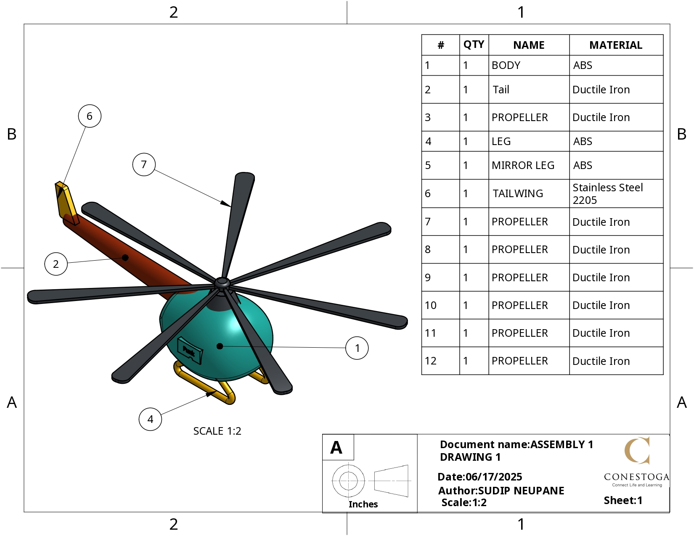

# 🚁 Helicopter Assembly – CAD Design (Onshape)

This project showcases a mechanical assembly of a small helicopter designed using **CAD software** (Onshape). It includes an Assembly and Bill of Materials (BOM), suitable for mechanical drafting and production documentation.

---

## 📄 Project Overview

- **Type:** Helicopter Assembly Drawing  
- **Author:** Sudip Neupane  
- **Date:** June 17, 2025  
- **Scale:** 1:2  
- **Drawing Sheet:** 1  
- **Units:** Inches  

---

## 🧩 Bill of Materials

| QTY | Part Name     | Material         |
|-----|---------------|------------------|
| 1   | BODY          | ABS              |
| 1   | Tail          | Ductile Iron     |
| 1   | PROPELLER     | Ductile Iron     |
| 1   | LEG           | ABS              |
| 1   | MIRROR LEG    | ABS              |
| 1   | TAILWING      | Stainless Steel  |
| 6   | PROPELLER     | Ductile Iron     |

---

## 📁 Files

---

## 🛠 Tools Used

- Onshape (design & drawing)

---

## 📬 Contact

For collaborations or feedback:  
**Sudip Neupane**  
📧 neupane.sudip22@gmail.com  
🌐 [LinkedIn Profile](https://www.linkedin.com/in/sudip-neupane99/)

---

## 🧷 License

This project is for educational and portfolio use. Attribution required if reused.

